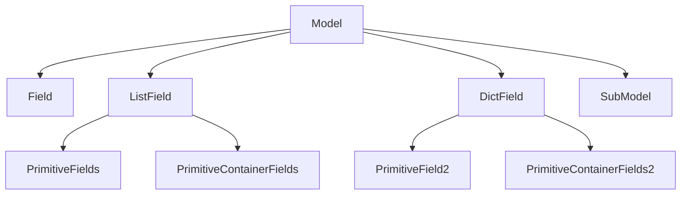

 

  <h3 align="center">OptiBlocks</h3>
  

    Optimization components for accelerator tools
  

## About
This repo contains 'mostly-standalone' pieces of apsopt that might be of interest to the community.
They can be used as is by importing the package, or feel free to just copy/paste.

## Getting started
### Prerequisites
* Python >= 3.8
* pyqt >= 5.12
* pyqt-test
* pyqtgraph

## Contents
### Pydantic parameter tree
Extension of the pyqtgraph ParameterTree system to support reading and writing Pydantic models.

The key implementation challenge is how to validate and handle edits of child elements - this 
must be done in the first available parent model, but copies of fields should be avoided because 
those objects might contain other state. For now, only a subset of object types are supported: 
BaseModel, primitive types, dict, and list.

The structure of parameters is:

